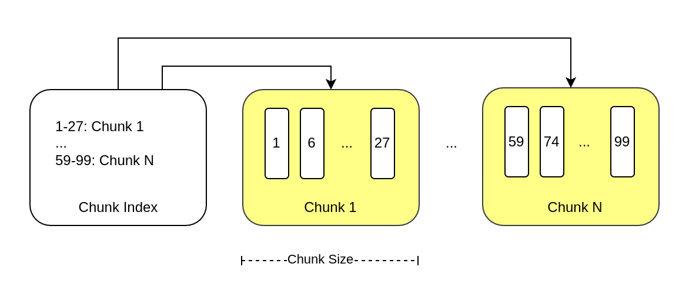

# Sorted Array Lib



This package allows to work with huge sorted arrays efficiently by splitting them in chunks under the hood.
The basic idea here is simple - avoid loading all the numbers into memory and only work with smaller parts of the
original array (chunking).

Motivation for this package is to be used for building inverted indexes.
The main requirement for such use-case is being memory and space-efficient.
I chose `uint32` as the element type to support indexing of unix timestamps.

## Usage Sample

```go
storage := NewInMemoryChunkStorage()
maxChunkSize := 1000
arr := NewSortedArray(maxChunkSize, storage)

arr.Add([]uint32{10, 20, 30, 40, 50})
arr.Delete([]uint32{10, 30, 50})
arr.Flush() // write to the storage

require.EqualValues(t, []uint32{20, 40}, arr.ToSlice())
```

## Storage

To store chunks one needs to implement this interface:

```go
type ChunkStorage interface {
Read(chunkIds []uint32) (map[uint32]*Chunk, error)
Save(chunks map[uint32]*Chunk) error
Remove(chunkIds []uint32) error

ReadMeta() ([]*ChunkMeta, error)
SaveMeta([]*ChunkMeta) error
}
```

Only an in-memory implementation is present in this package used for testing purposes.
Transactions are not assumed by this package. I kept in mind one particular use-case: sqlite as a storage.
One would start an SQLite transaction and within this transaction load this index and work with numbers.
SQLite would handle concurrent access. Within Sqlite I would use blobs to keep this array's chunks.

## Compression

A sorted array is perfect for compression. It looks like the best algorithms are designed by Lemire:
https://lemire.me/blog/2012/09/12/fast-integer-compression-decoding-billions-of-integers-per-second/

Some GO implementations are:

- https://zhen.org/blog/benchmarking-integer-compression-in-go/
- https://github.com/ronanh/intcomp
- https://github.com/Akron/encoding

## Concurrent Access And Garbage Collector

This lib loads chunks into memory. Chunks are determined based on meta description and input given to
Add/Delete/GetInRange. Loaded chunks are freed (for further GC) upon these events:

- Flush() called
- GetInRage() loads and frees one chunk at a time while iterating

